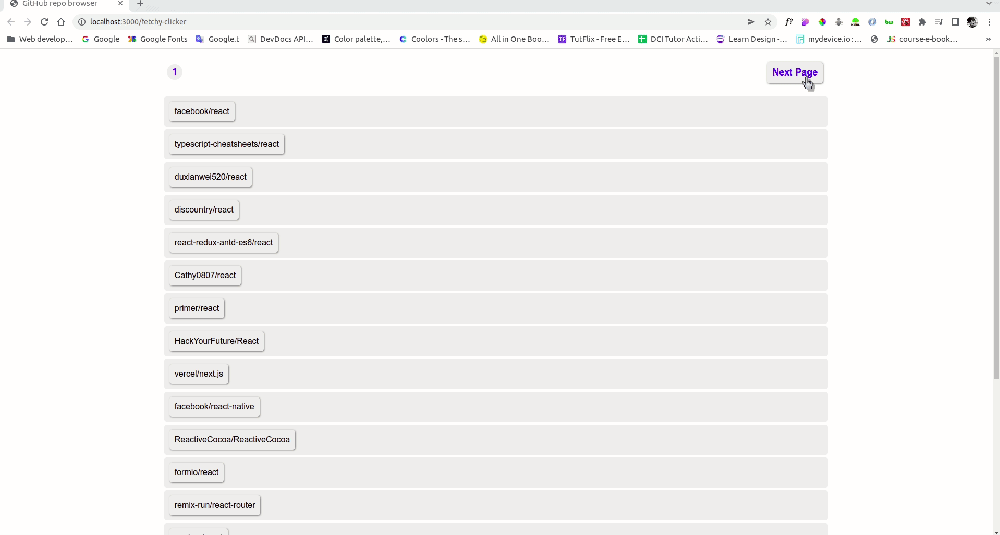

# Fetchy-Clicker

A small React exercise to that uses the Github api to search and navigate through Github repositories.

## Demo

## Lessons Learned

#### in this project i was able to:
1. fetching data from an api
2. create a simple pagination using the last part of the URL
3. diplaying the next and previous page buttons
4. adding a spinner 